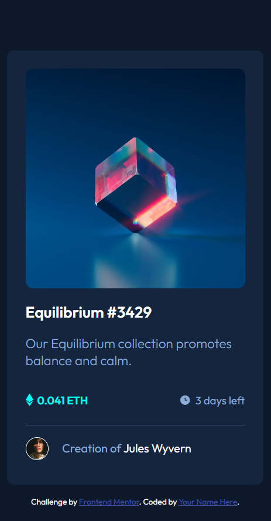

# Frontend Mentor - NFT preview card component solution

This is a solution to the [NFT preview card component challenge on Frontend Mentor](https://www.frontendmentor.io/challenges/nft-preview-card-component-SbdUL_w0U). Frontend Mentor challenges help you improve your coding skills by building realistic projects. 

## Table of contents

- [Overview](#overview)
  - [The challenge](#the-challenge)
  - [Screenshot](#screenshot)
  - [Links](#links)
- [My process](#my-process)
  - [Built with](#built-with)
  - [What I learned](#what-i-learned)
- [Author](#author)

**Note: Delete this note and update the table of contents based on what sections you keep.**

## Overview

### The challenge

Users should be able to:

- View the optimal layout depending on their device's screen size
- See hover states for interactive elements

### Screenshot

### Links

- Solution URL: [solution](https://github.com/mail2ifham/Frontend-nft-preview-card-component-main)
- Live Site URL: [live site]( https://mail2ifham.github.io/Frontend-nft-preview-card-component-main/)

## My process

### Built with

- Semantic HTML5 markup
- CSS custom properties
- CSS  animation
### What I learned

This is my first frontend mentor challenge. It was nice expedience for me as a beginner. it's not hard ,but it toke little time to complete and  I enjoy the process. 

## Author

- Name - Mohammed Ifham
- Frontend Mentor - [@mail2ifham](https://www.frontendmentor.io/profile/mail2ifham)